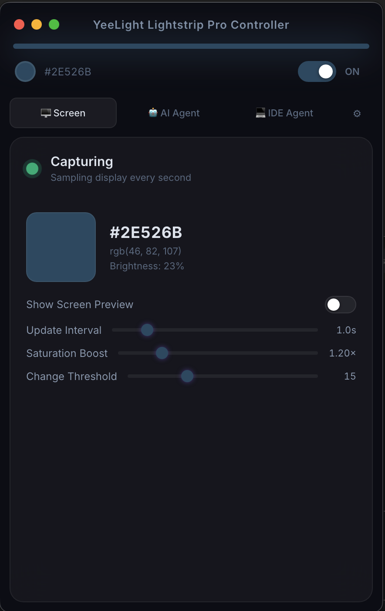
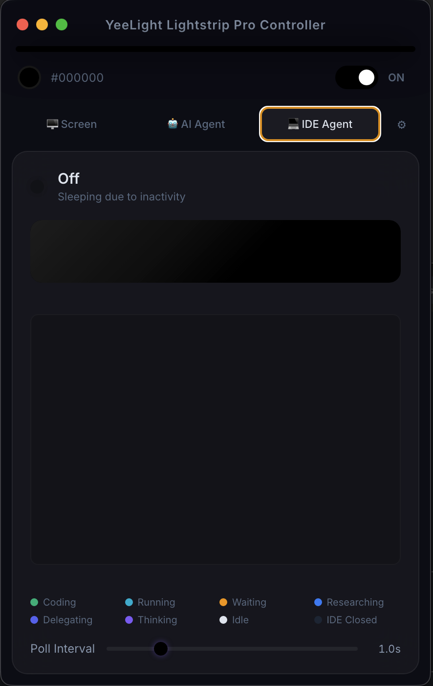
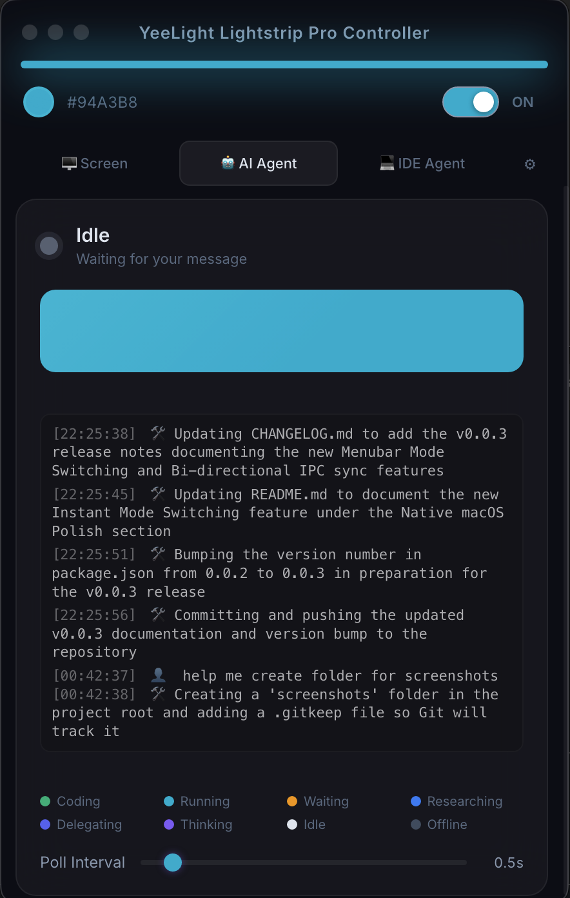

# YeeLight Lightstrip Pro Controller

YeeLight Lightstrip Pro Controller is a native macOS menu bar and desktop application built with Electron. It seamlessly synchronizes your Home Assistant smart lights (like Yeelight light strips) with your on-screen activity and the real-time status of your Antigravity AI agents.


## Screenshots
<p align="center">
  
  
  
</p>

## Compatibility & Acknowledgements

> [!IMPORTANT]
> **This application has currently only been tested with the following specific hardware and software stack:**
> * **Hardware**: Yeelight Strip Pro (bound to Mijia International).
> * **Integration**: Integrated with [Home Assistant](https://www.home-assistant.io/) using the [Xiaomi Miot](https://github.com/al-one/hass-xiaomi-miot) integration.
> * **Management**: Managed via [HACS](https://hacs.xyz/) (Home Assistant Community Store).
>
> A huge thank you to the creators and maintainers of [Home Assistant](https://www.home-assistant.io/), [HACS](https://hacs.xyz/), and the [hass-xiaomi-miot](https://github.com/al-one/hass-xiaomi-miot) project for making this integration possible!

## Features

### 🖥️ Dynamic Screen Mode (Ambilight)
Transforms your workspace into an immersive environment. 
* Captures your screen in real-time and calculates a heavily optimized, highly responsive **weighted RGB average**.
* Perfectly mimics the ambient glow of your screen—breathing and shifting organically with movie scenes, window movements, and scrolling webpages.
* **Smooth Color Transitions**: Hardware commands are dispatched with a customized 100ms hardware fade transition for ultra-fluid color matching without jarring, instantaneous flashes.
* **Energy Saving Auto-Off**: If the screen remains completely static for exactly 10 minutes (configurable via threshold), the app automatically turns off your light strip. The absolute second you move your mouse or change a tab, the light instantly wakes up and resumes its ambient glow!

### 🤖 AI Agent Sync Modes
Ever wonder what your autonomous AI agents are doing in the background? Now your room will tell you.
* **AI Agent Mode & IDE Agent Mode**: Syncs your physical light strip to the real-time processing state of the Antigravity engine.
* **Smart State Detection**: Uses advanced log-parsing heuristics to determine exactly what the agent is doing:
  * 🔵 **Running** (Executing commands in the terminal)
  * 🟢 **Coding** (Creating or modifying files)
  * 🟦 **Researching** (Searching the web, grepping, or reading files)
  * 🟣 **Thinking** (Processing your input or generating a response)
  * 🟠 **Pending / Blocked** (Waiting for your explicit permission/approval)
  * 🟪 **Delegating** (Managing or communicating with subagents)
  * 🩷 **Generating** (Creating AI images or media)
  * ⚪ **Idle** (Waiting for your next message)
  * 🟤 **Inactive** (Agent has been idle for more than 5 minutes)
  * ⚫ **Offline / Off** (Agent is not running or tracking is disabled)
* **30-Second Heuristic**: Overcomes native IDE file-buffering quirks by intelligently separating long code generations from hard user-approval blocks.

### 🍏 Native macOS Polish
* **Retina Menu Bar Icon**: Features a custom-rendered, high-DPI (44x44 downsampled) menu bar status indicator that sits perfectly in your macOS menu bar without edge-clipping.
* **Instant Mode Switching**: Right-click (or left-click) the menu bar dot to summon a native context menu, allowing you to instantly switch between Dynamic Screen Mode, AI Agent Mode, and IDE Mode without ever opening the main application window!
* Click "Show App" from the context menu to instantly summon the full YeeLight Lightstrip Pro Controller configuration panel.

### 🎛️ Full Customization
The built-in UI gives you granular control over the engine:
* **Home Assistant Integration**: Input your HA URL, Long-Lived Access Token, and Target Entity ID.
* **Performance Tuning**: Adjust screen capture intervals (ms) and status polling rates to save CPU.
* **Vibrance & Thresholds**: Control the baseline brightness, apply a flat **Saturation Boost** to ensure the light strip remains punchy and colorful, and set a **Color Threshold** to prevent microscopic network spam.

### 🛡️ Robustness & Security
* **Secure by Default:** Zero `innerHTML` usage guarantees XSS protection, and a dynamic Content Security Policy (CSP) restricts frontend resources.
* **CORS-Bypass IPC Proxy:** All Home Assistant API calls are routed securely through an internal Node.js IPC proxy. This entirely bypasses Chromium's strict CORS enforcement, guaranteeing flawless network connectivity without having to disable `webSecurity`.
* **Global Error Awareness:** If the app ever loses connection to Home Assistant, a beautiful, non-intrusive floating error pill automatically slides down from the titlebar to warn you, and seamlessly hides itself once the connection is restored.
* **Rock-Solid Stability:** Comprehensive null-pointer guards, IPC listener leak prevention, and isolated background polling timers ensure the app runs flawlessly for weeks without CPU or memory leaks.
* **Uninterruptible Network Resilience:** All backend API calls are wrapped in strict 5-second timeouts, preventing your app from stalling or freezing when your local network or Home Assistant server drops out.
* **Flawless UI Layout:** The UI flexbox has been heavily optimized with hard max-height bounds, guaranteeing that your controls, sliders, and legend never get pushed off-screen by massive AI agent logs.

## Installation

1. Clone this repository.
2. Ensure you have Node.js and npm installed.
3. Install dependencies:
   ```bash
   npm install
   ```
4. Start the application:
   ```bash
   npm start
   ```

## Configuration

Upon launching the app for the first time, navigate to the **Settings** tab. You will need:
1. The URL to your Home Assistant instance (e.g., `http://192.168.1.100:8123`).
2. A Long-Lived Access Token generated from your Home Assistant user profile.
3. The Entity ID of the light you wish to control (e.g., `light.my_desk_strip`).

Settings are securely saved to your local machine and automatically reloaded on launch.

## Architecture

* `main.js`: The Electron main process. Manages the system tray, file I/O, IPC bridging, and parses the highly complex Antigravity transcript logs to determine accurate AI agent states.
* `renderer.js`: The frontend logic. Handles UI interactions, the Screen Mode canvas/video capturing, Ambilight RGB calculations, and Home Assistant REST API communication.
* `preload.js`: Secure context bridge between the Node environment and the web frontend.

## License

MIT License
